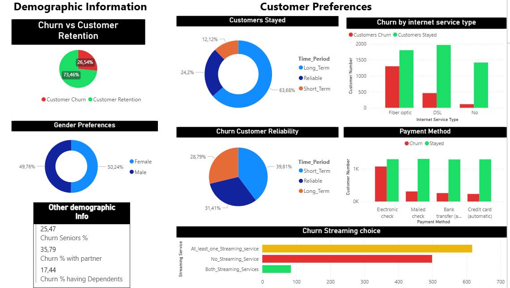
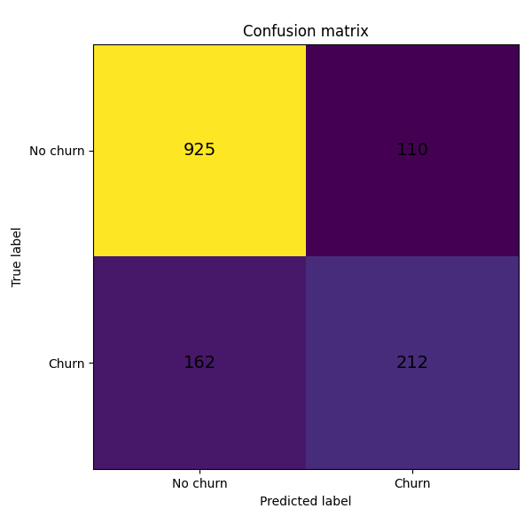

# Telco Customer Churn Analysis and Prediction

**End-to-End Data Analytics and Machine Learning Project**  
**Michalis Loizos, August 2025**

  
  


This project explores customer churn trends and builds a predictive model using logistic regression. The analysis provides actionable insights for reducing churn and retaining customers.

---

## Project Overview

This project provides a comprehensive analysis of telco customer churn. The goal is to identify the key factors that lead to customer churn and to build a predictive model that can identify at-risk customers. The workflow includes SQL-based data exploration, dashboard generation using Power BI, and churn prediction using Python.

---

## Tech Stack

- **Data Cleaning & Exploration**: SQL
- **Data Visualization & Reporting**: Power BI, DAX
- **Machine Learning & Modeling**: Python
  - Core Libraries: Pandas, Scikit-learn, Matplotlib

---

## Project Structure

The dataset can be accessed here: [Telco Customer Churn Dataset](https://www.kaggle.com/datasets/blastchar/telco-customer-churn)

- `Telco_Churn_Dashboard.pbix`: Power BI file containing the interactive dashboard.
- `dashboard.png`: Screenshot of the Power BI dashboard.
- `Telco_Churn_Dashboard.pdf`: PDF version of the dashboard.
- `Telco_Churn_SQL_Queries.sql`: SQL queries used for data exploration.
- `Telco_Churn_Prediction.py`: Python script for churn prediction.
- `Classification_Report.txt`: Logistic regression metrics (accuracy, precision, F1 score, recall).
- `Confusion_Matrix.png`: Visual representation of the confusion matrix.

---

## Exploratory Data Analysis (EDA)

SQL was used for the initial investigation of the dataset, uncovering relationships between customer attributes and churn. Key focus areas included:

- **Customer Demographics**: Gender, age, dependents.
- **Account Information**: Contract type, tenure, and payment method.
- **Service Usage**: Phone, internet, and tech support.

The SQL scripts in the `Telco_Churn_SQL_Queries.sql` file created the data views for the Power BI dashboard.

---

## Power BI Dashboard

An interactive dashboard was developed in Power BI to provide a high-level overview of churn analysis. Key features include:

- Overall churn rate and customer counts.
- Breakdowns of churn by contract type, internet service, and other critical factors.
- DAX measures for Total Churn Rate and Revenue by Customer Segment.

### Dashboard Screenshot


---

## Churn Prediction Model

A logistic regression model was built using Python and the Scikit-learn library to predict whether a customer will churn. The model enables telco providers to proactively retain at-risk customers.

### Model Performance
- **Accuracy**: 80.7%, indicating strong predictive capabilities.
- **Performance Breakdown**:
  - The model is highly effective at identifying customers who will not churn.
  - Moderate performance in predicting customers who are likely to churn.

### Confusion Matrix


---

## How to Reproduce This Project

To explore the components of this project, follow these steps:

1. Clone this repository:
   ```bash
   git clone https://github.com/michloiz/Telco-Customer-Churn-End-to-End-Analysis-and-Prediction.git
   ```
2. View the SQL Queries:
   - Open the `Telco_Churn_SQL_Queries.sql` file to explore the SQL scripts used for analysis.
3. Explore the Dashboard:
   - Download the `Telco_Churn_Dashboard.pbix` file and open it using Power BI Desktop.
4. Run the Prediction Model:
   - Install the required Python libraries listed in the `Telco_Churn_Prediction.py` script.
   - Execute the Python script to generate predictions and metrics.

---

## Contact

Feel free to reach out for any inquiries:

- **LinkedIn**: [Michalis Loizos](https://www.linkedin.com/in/michalis-loizos/)  
- **Email**: [mihalis.loizos@gmail.com](mailto:mihalis.loizos@gmail.com)

---

## License

This project is licensed under the [MIT License](LICENSE).
